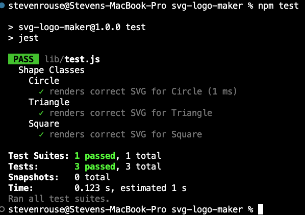

# SVG Logo Maker

## Description
A command line appplication that takes user input and generates a logo image and saves in in a .svg file.

## Table of Contents
- [Installation](#installation)
- [Usage](#usage)
- [License](#license)
- [Tests](#tests)
- [Questions](#questions)

## Installation
This is a Node.js application. to install, run:  
>npm i  to install all necessary packages.

## Usage
Launch Command: > node index.js
When the application successfuly launches, the user will be presented with a series of prompts, including shapes, text, and colors. The app will then generate a simple logo, based on the user inputs.  The file is saved in ./examples/logo.svg

## License

This project is licensed under the MIT license.

## Tests
The application is equipped with Jest for testing expected outputs.  
Test Command: >npm test  

Here is a sample of the test output:  

## Questions
For questions, contact steve17rouse@gmail.com  
Visit [GitHub](https://github.com/stever001).